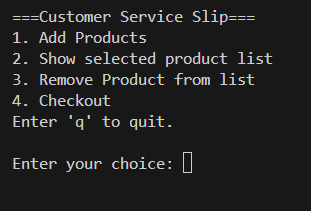
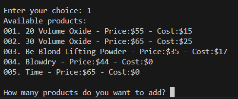
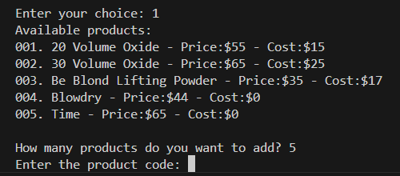
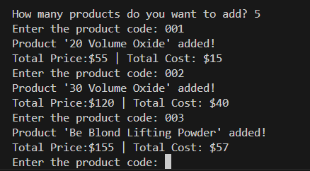
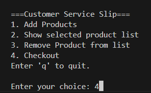
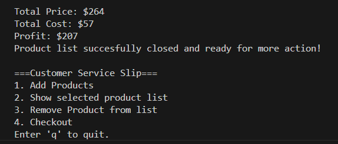
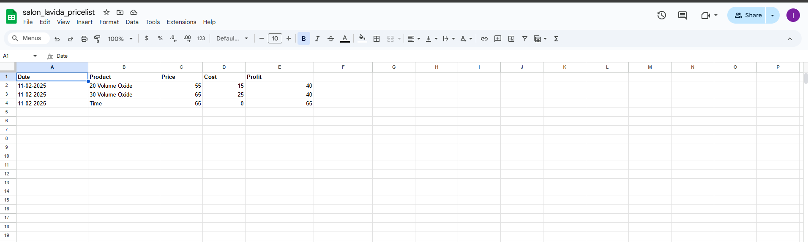

# Welcome to the Salon LaVida Service Management System, #

## Introduction to Salon LaVida Service Management System

Welcome to the Service Management System for Salon LaVida, a dynamic and user-friendly Python project designed specifically to streamline the process of managing services, pricing, and sales for the salon. Inspired by the needs of my sister's salon, this project integrates essential business functions, allowing the salon to maintain accurate and organized records of the products and services used throughout the day.

The core functionality of the system includes adding, removing, and tracking products and services, calculating totals, and handling sales data efficiently.

### Key Features:
- **Product Management**: The system stores a list of products and their corresponding prices and costs, from hair care treatments to styling products. Each product can be added or                        removed as services are completed.
- **Service List Management**: Salon employees can add and remove services to a customer’s order list, displaying the total price and cost in real-time.
- **Checkout Process**: Once services are complete, the system calculates the total price, cost, and profit, and saves the sales data to a `daily_sales.txt` file for record-keeping.

By implementing this system, Salon LaVida ensures accurate pricing and
inventory tracking, while also optimizing the overall customer experience
by reducing administrative overhead.

Let’s make the business process smoother, organized, and more profitable
with this tool!

 **February 10, 2025**
### Planning

I’ve been working on a project to design an app that simplifies tasks for my sister, Jo-Ann, who owns her own hair salon. After discussing her needs with her during a client call, I gained a clearer understanding of what would be both manageable for me to build as a beginner and practical for her to implement in her business.

The next step was to explore existing systems that offer functionalities like shopping carts or shopping lists. This helped me determine which features would be most relevant for the app. From there, I created a chart to map out the necessary building blocks and understand the components that would need to be developed.

I decided to add my product list as a class, as classes can encapsulate both data (attributes) and behavior (methods) related to products. This allows me to define clear operations (e.g., add_product(), remove_product(), update_price()), as well as being scalable for the future and being more readable.

### Functionality

- Initial page featuring a welcome message and a list of functions to choose from.
---

- The list of functions to choose from and a prompt for the user to enter the chosen option.
---

- When a option "1" is chosen, the product menu is shown, with a prompt to the user to
confirm the number of items that should be added to the list.
---

- The list only contains 5 Items for this project, but the list can be
added to in the future and adjusted as products change.
---

- A prompt for the user to enter the relevant item codes.
---

- A list of the Items added to the list is displayed.
- In the instance a irrelevant code is entered a "false" statement will appear for only that code.
---

- Once the list/service is completed the checkout function can be triggered by choosing option "4".
---

- Upon successful checkout the total price and cost will be shown and relevent sales data will be sent to Daily_sales.txt.
---

- "q" can be used at any step in the process to abort.
---

- Data is sent to the google sheet once checkout is complete.
---

## Testing

- Extensive testing was done by myself in VS Code.
- The live site on [Heroku](https://salon-lavida-service-app-30430987c2a8.herokuapp.com/)
- Code was run through the [Code Institute CI Python Linter](https://pep8ci.herokuapp.com/)

## References

I did a great deal of searching to find add on solutions to the functionality I wanted for this project. Here are a list of the different reference videos and websites I used.

- https://micropyramid.com/blog/understand-self-and-__init__-method-in-python-class#:~:text=self%20represents%20the%20instance%20of,of%20the%20class%20in%20python.&     text=%22__init__%22%20is%20a%20reseved,constructor%20in%20object%20oriented%20concepts

- https://www.youtube.com/watch?v=505pA-hUOFI

- https://stackoverflow.com/questions/29956883/appending-data-to-txt-file

- https://www.youtube.com/watch?v=Dw85RIvQlc8

- https://www.w3schools.com/python/python_functions.asp

- https://testdriven.io/blog/clean-code-python/

- https://www.youtube.com/watch?v=lbWCP-KMun8

- https://ntsh-vicky.medium.com/basic-of-python-date-time-91349829971b

- https://www.freecodecamp.org/news/python-switch-statement-switch-case-example/

---

Happy coding!
