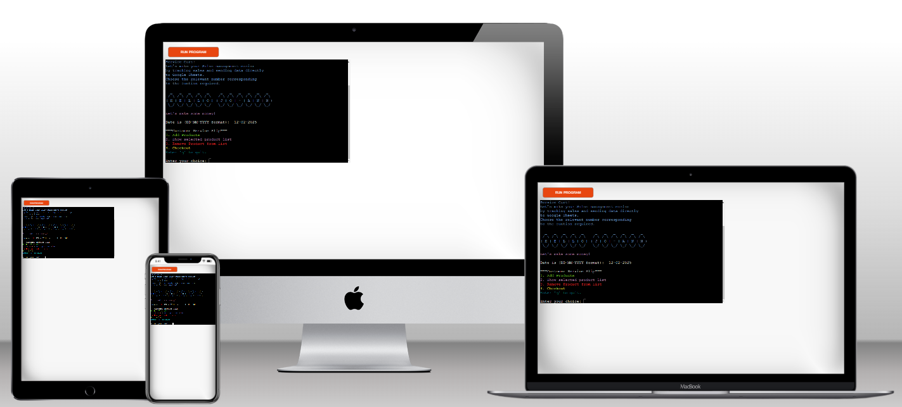

# Welcome to the Salon LaVida Service Management System, #

## Introduction to Salon LaVida Service Management System

Welcome to the Service Management System for Salon LaVida, a dynamic and user-friendly Python project designed specifically to streamline the process of managing services, pricing, and sales for the salon. Inspired by the needs of my sister's salon, this project integrates essential business functions, allowing the salon to maintain accurate and organized records of the products and services used throughout the day.

The core functionality of the system includes adding, removing, and tracking products and services, calculating totals, and handling sales data efficiently.

### Key Features:

- **Product Management**: The system stores a list of products and their corresponding prices and costs, from hair care treatments to styling products. Each product can be added or removed as services are completed.
- **Service List Management**: Salon employees can add and remove services to a customer’s order list, displaying the total price and cost in real-time.
- **Checkout Process**: Once services are complete, the system calculates the total price, cost, and profit, and saves the sales data to a "salon_lavida_pricelist" file for record-keeping.

By implementing this system, Salon LaVida ensures accurate pricing and inventory tracking, while also optimizing the overall customer experience
by reducing administrative overhead.

Let’s make the business process smoother, organized, and more profitable
with this tool!

 **February 10, 2025**

### Planning

I’ve been working on a project to design an app that simplifies tasks for my sister, Jo-Ann, who owns her own hair salon. After discussing her needs with her during a client call, I gained a clearer understanding of what would be both manageable for me to build as a beginner and practical for her to implement in her business.

The next step was to explore existing systems that offer functionalities like shopping carts or shopping lists. This helped me determine which features would be most relevant for the app. From there, I created a chart to map out the necessary building blocks and understand the components that would need to be developed.

The design of this program was set up with careful consideration to ensure efficient and user-friendly salon management for tracking sales and services. Below is a detailed explanation of the key design choices and their purpose:

#### Modular Structure

- The code is well-organized into multiple classes and functions, making it modular and maintainable:

- Product class: Represents individual products in the salon, encapsulating product details like code, name, price, and cost.
- ProductList class: Manages the product catalog and tracks selected services. It maintains lists for service tasks and handles price and cost calculations.
- ServiceToDoApp class: Acts as the main controller for the application, integrating user interactions, product selection, and communication with Google Sheets for sales tracking.
- This modular approach promotes separation of concerns (fancy term found on a blog), making it easier to extend or modify specific features without affecting unrelated parts of the program.
- As a new developer, I have found that adopting a modular code structure not only enhances efficiency in building required functions but also significantly improves the troubleshooting process by making errors easier to identify and resolve.

#### Google Sheets Integration

- The connect_to_google_sheets() function connects to Google Sheets using service account credentials.
- The checkout() method sends sales data (date, product name, price, cost, and profit) directly to a designated Google Sheets worksheet (daily_sales).
- This ensures that sales data is automatically logged in a centralized, cloud-based platform, reducing manual record-keeping and making it easy to access and analyze data remotely.

#### User-Friendly Console Interface

- The program uses the Colorama library for color-coded messages to enhance user experience:

- Green for successful operations
- Red for errors or warnings
- Blue for important information The app also features clear menus (display_menu()), input prompts, and detailed instructions.
- Color-coded messages make the console interface more readable, helping users quickly identify information.
- User prompts with "abort" options provide a seamless and error-tolerant workflow.

#### Checkout and Data Persistence

- During checkout, the app calculates totals and profits for selected services and then appends the sales data to Google Sheets.
- Automating data persistence ensures that no sales information is lost.
- Additionally, the profit calculation allows salon managers to track financial performance effortlessly.

#### Flexible Product Selection and Removal

- Users can:

- Add multiple products (add_products()).
- Remove products from the selected list (remove_product()).
- View the current list of selected services (show_selected_products()).
- This provides flexibility in managing customer orders.
- Users can adjust their service list as needed without restarting the app.

#### Error Handling and Input Validation

- The program includes input validation to handle invalid entries gracefully, such as:

- Ensuring product codes exist before adding them.
- Handling non-numeric or out-of-range inputs for product quantities.
- Providing the option to abort operations at any step.

#### Object-Oriented Design

- Each class has a clear responsibility, enhancing code readability and reusability.
- Object-oriented design ensures that changes can be made independently in each component. For instance, adding new product attributes would only require updating the Product class without affecting other parts of the system.

#### Conclusion
This code structure was designed to balance user experience, maintainability, and data automation. By combining object-oriented principles, third-party integrations (Colorama and Google Sheets), and robust error handling, the program becomes a reliable tool for managing a salon's service and sales operations efficiently.

---

### Possible extention of the app

- The app can be further expanded with additional functionalities to enhance salon management efficiency.
- Features like inventory management can be integrated to track product stock levels, automatically deducting used items during checkout and alerting when stock is low.
- Customer profiles can store client information, including service history and preferences, allowing personalized service and targeted promotions.
- Additionally, implementing appointment scheduling, sales analytics dashboards, and staff management can make the app a comprehensive solution for salon operations, streamlining both customer engagement and backend processes.

---

### Functionality

- Initial page featuring a welcome message and a list of functions to choose from.

---

- The list of functions to choose from and a prompt for the user to enter the chosen option.

---

- When a option "1" is chosen, the product menu is shown, with a prompt to the user to
confirm the number of items that should be added to the list.

- The list only contains 5 Items for this project, but the list can be
added to in the future and adjusted as products change.

---

- A list of the Items added to the list is displayed.
- In the instance a irrelevant code is entered a "false" statement will appear for only that code.

---

- items can be removed from the list before checkout is initialised.

---

- Once the list/service is completed the checkout function can be triggered by choosing option "4".

---

- Upon successful checkout the total price and cost will be shown and relevent sales data will be sent to daily_sales google sheet.

---

- "q" can be used at any step in the process to abort.

---

- Data is sent to the google sheet once checkout is complete. In the sheet, the daily profit is calculated per date.

---

## Testing and Debugging

- Extensive testing was done by myself in VS Code.
  - Test for inputs:
    - a letter a
    - multiple letters abc
    - a number 1
    - zero 0
    - multiple numbers 123
    - an empty ENTER with nothing ENTER
    - only spaces
    - special characters ? ! @

- The live site on [Heroku](https://salon-lavida-service-app-30430987c2a8.herokuapp.com/)
- Code was run through the [Code Institute CI Python Linter](https://pep8ci.herokuapp.com/)

- I struggled to add the Date function. Not only to add it, but to send the data correctly to the gspread.

## Deployment

### Deployment for me as the developer

- Use this link to connect to [Heroku](https://www.heroku.com/).
- In the top right hand corner click the burger-icon and choose Dashboard.
- Click on the link for salon-lavida-service-app.
- Click on Deploy and then on Deploy Branch.

### Deployment for the User

- Connect to the live site on [Heroku](https://salon-lavida-service-app-30430987c2a8.herokuapp.com/)

## References

I did a great deal of searching to find add on solutions to the functionality I wanted for this project. Here are a list of the different reference videos and websites I used.

- https://micropyramid.com/blog/understand-self-and-__init__-method-in-python-class#:~:text=self%20represents%20the%20instance%20of,of%20the%20class%20in%20python.&     text=%22__init__%22%20is%20a%20reseved,constructor%20in%20object%20oriented%20concepts

- https://www.youtube.com/watch?v=505pA-hUOFI

- https://stackoverflow.com/questions/29956883/appending-data-to-txt-file

- https://www.youtube.com/watch?v=Dw85RIvQlc8

- https://www.w3schools.com/python/python_functions.asp

- https://testdriven.io/blog/clean-code-python/

- https://www.youtube.com/watch?v=lbWCP-KMun8

- https://ntsh-vicky.medium.com/basic-of-python-date-time-91349829971b

- https://www.freecodecamp.org/news/python-switch-statement-switch-case-example/

- https://medium.com/towards-data-science/prettify-your-terminal-text-with-termcolor-and-pyfiglet-880de83fda6b

---

## Contact

- Please feel free to contact me on [Illana De Beer](c.wnt.nd1053@gmail.com)
- The live App in [Heroku](https://salon-lavida-service-app-30430987c2a8.herokuapp.com/)
- The goodle sheet [salon-_lavida_pricelist](https://docs.google.com/spreadsheets/u/0/?ec=wgc-sheets-[module]-goto)

